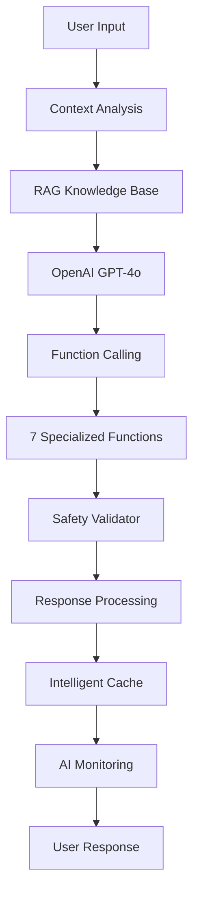

# 🤖 Ici Ça Pousse - AI Integration Engineer Portfolio

[](https://openai.com/)
[](https://reactjs.org/)
[](https://firebase.google.com/)
[](https://jestjs.io/)
[](https://jestjs.io/)
[](https://vercel.com/)
[](LICENSE)

---

## 🇫🇷 **Pitch IA - En 3 Lignes**

**Ici Ça Pousse** est une application de fitness qui démontre une **intégration IA complète et sophistiquée** avec OpenAI GPT-4o, résolvant le problème de personnalisation des entraînements grâce à l'analyse contextuelle de l'historique utilisateur et la génération intelligente de recommandations.

**L'IA analyse les 5 dernières séances, détecte les groupes musculaires sous-traités, et génère des séances personnalisées avec validation de sécurité automatique.**

**Technologies IA : OpenAI GPT-4o + Function Calling, RAG (Retrieval-Augmented Generation), Safety Validator, AI Monitoring Dashboard, ML de prédiction de poids, et cache intelligent avec TTL adaptatif.**

---

## 🇬🇧 **AI Pitch - In 3 Lines**

**Ici Ça Pousse** is a fitness application that demonstrates **complete and sophisticated AI integration** with OpenAI GPT-4o, solving the problem of workout personalization through contextual analysis of user history and intelligent recommendation generation.

**The AI analyzes the last 5 sessions, detects undertrained muscle groups, and generates personalized workouts with automatic safety validation.**

**AI Technologies: OpenAI GPT-4o + Function Calling, RAG (Retrieval-Augmented Generation), Safety Validator, AI Monitoring Dashboard, ML weight prediction, and intelligent cache with adaptive TTL.**

---

## 🌐 **Live Application | Application Live**

**[🌐 Application Live](https://ici-ca-pousse.vercel.app)**

---

## 🧠 **Intégration IA - Architecture & Flux | AI Integration - Architecture & Flow**

### 🇫🇷 **Rôle de l'IA dans l'Application**

L'IA agit comme un **Coach Personnel Intelligent** qui :

- **Analyse contextuellement** l'historique d'entraînement (5 dernières séances)
- **Génère des séances personnalisées** basées sur le profil utilisateur
- **Valide automatiquement** la sécurité des recommandations
- **Suit les performances** en temps réel via un dashboard dédié
- **Optimise les réponses** grâce à un système de cache intelligent

### 🇬🇧 **AI Role in the Application**

The AI acts as an **Intelligent Personal Coach** that:

- **Contextually analyzes** training history (last 5 sessions)
- **Generates personalized workouts** based on user profile
- **Automatically validates** recommendation safety
- **Tracks performance** in real-time via dedicated dashboard
- **Optimizes responses** through intelligent caching system

### **Flux d'Intégration IA | AI Integration Flow**



---

## 🚀 **Stack Technique - IA First | Technical Stack - AI First**

### **Technologies IA | AI Technologies**

- **OpenAI GPT-4o** : Modèle principal avec Function Calling | Main model with Function Calling
- **OpenAI Function Calling** : 7 fonctions spécialisées pour le fitness | 7 specialized fitness functions
- **RAG System** : Base de connaissances avec recherche sémantique | Knowledge base with semantic search
- **Safety Validator** : Validation automatique des recommandations | Automatic recommendation validation
- **AI Monitoring** : Dashboard de performance temps réel | Real-time performance dashboard
- **ML Weight Prediction** : Système de prédiction de poids intelligent | Intelligent weight prediction system
- **LEX IA** : Interface utilisateur pour le coach IA personnel | User interface for personal AI coach
- **Performance Optimization** : Cache intelligent, timeout, limitation des fonctions | Intelligent cache, timeout, function limiting

### **Backend & Infrastructure**

- **Firebase 12.0.0** : Auth, Firestore, Storage, Cloud Functions
- **Vercel** : Déploiement serverless avec CI/CD | Serverless deployment with CI/CD
- **Intelligent Cache** : TTL adaptatif selon le type de contenu | Adaptive TTL based on content type
- **Error Handling** : Gestion robuste des erreurs IA | Robust AI error handling
- **Performance Monitoring** : Timeout 30s, limitation historique, optimisation RAG | 30s timeout, history limiting, RAG optimization

### **Frontend & UX**

- **React 18.3.1** : Hooks personnalisés, Context API | Custom hooks, Context API
- **Framer Motion** : Animations fluides | Smooth animations
- **Recharts** : Visualisations de données | Data visualizations
- **PWA Ready** : Service workers, installation

### **Tests & Qualité | Tests & Quality**

- **Jest** : 418 tests, 88% de couverture | 418 tests, 88% coverage
- **Testing Library** : Tests des hooks IA et fonctions | AI hooks and functions testing
- **ML Tests** : Tests complets du système de prédiction de poids | Complete weight prediction system tests
- **ESLint + Prettier** : Qualité de code | Code quality
- **TypeScript** : Typage statique (en cours) | Static typing (in progress)

---

## 🎯 **Pourquoi ce Projet est Pertinent | Why This Project is Relevant**

### 🇫🇷 **Capacité d'Intégration IA Complète**

- ✅ **OpenAI API Mastery** : Utilisation avancée de GPT-4o avec Function Calling
- ✅ **Prompt Engineering** : Optimisation des prompts pour des réponses spécialisées
- ✅ **Context Management** : Gestion intelligente du contexte utilisateur
- ✅ **RAG Implementation** : Système de base de connaissances avec recherche sémantique
- ✅ **ML Weight Prediction** : Système de prédiction de poids basé sur l'historique
- ✅ **LEX IA Interface** : Interface utilisateur intuitive pour le coach IA

### 🇬🇧 **Complete AI Integration Capability**

- ✅ **OpenAI API Mastery** : Advanced GPT-4o usage with Function Calling
- ✅ **Prompt Engineering** : Prompt optimization for specialized responses
- ✅ **Context Management** : Intelligent user context management
- ✅ **RAG Implementation** : Knowledge base system with semantic search
- ✅ **ML Weight Prediction** : Weight prediction system based on history
- ✅ **LEX IA Interface** : Intuitive user interface for AI coach

### **Maîtrise de l'Orchestration Backend | Backend Orchestration Mastery**

- ✅ **Firebase Integration** : Auth, Firestore, Storage, security rules
- ✅ **Serverless Architecture** : Cloud Functions, Vercel deployment
- ✅ **Real-time Data** : Real-time synchronization with Firebase
- ✅ **Error Handling** : Robust error handling and fallbacks

### **Monitoring & Analytics IA | AI Monitoring & Analytics**

- ✅ **AI Performance Dashboard** : Métriques temps réel | Real-time metrics
- ✅ **User Satisfaction Tracking** : Suivi de la satisfaction | Satisfaction tracking
- ✅ **Safety Monitoring** : Score de sécurité en temps réel | Real-time safety score
- ✅ **Performance Optimization** : Cache intelligent et optimisation | Intelligent cache and optimization
- ✅ **Response Time Optimization** : Timeout 30s, limitation des fonctions, optimisation RAG | 30s timeout, function limiting, RAG optimization
- ✅ **ML Analytics** : Analyse des prédictions et tendances de progression | Prediction analysis and progression trends
- ✅ **Weight Prediction Insights** : Insights détaillés sur la progression des poids | Detailed weight progression insights

---

## 🔧 **Compétences Démontrées | Demonstrated Skills**

### **🤖 Intégration OpenAI Avancée | Advanced OpenAI Integration**

```javascript
// Gestion complète de l'API OpenAI | Complete OpenAI API management
const handleOpenAIIntegration = async (content, context, user) => {
  // 1. Enrichissement contextuel avec RAG | Contextual enrichment with RAG
  const enrichedContext = knowledgeBase.generateEnrichedContext(content, user);

  // 2. Sélection intelligente des fonctions | Intelligent function selection
  const relevantFunctions = getRelevantFunctions(content, context);

  // 3. Appel API avec gestion d'erreurs | API call with error handling
  const response = await callOpenAI(enrichedContent, relevantFunctions);

  // 4. Traitement des réponses avec validation | Response processing with validation
  const validatedResponse = validateAndProcessResponse(response);

  // 5. Mise en cache avec TTL adaptatif | Caching with adaptive TTL
  intelligentCache.set(cacheKey, validatedResponse, adaptiveTTL);
};
```

### **🔒 Sécurité & Validation IA | AI Security & Validation**

```javascript
// Système de validation automatique | Automatic validation system
const safetyValidator = {
  validateExerciseRecommendation: (exercise, userProfile) => {
    // Vérification des exercices interdits | Forbidden exercise verification
    // Validation des limites d'intensité | Intensity limit validation
    // Analyse des risques de blessure | Injury risk analysis
    // Score de sécurité (0-100) | Safety score (0-100)
    // Gestion des valeurs undefined | Undefined value handling
  },

  validateNutritionRecommendation: (nutrition, userProfile) => {
    // Vérification des suppléments interdits | Forbidden supplement verification
    // Validation des limites caloriques | Caloric limit validation
    // Analyse des macro-nutriments | Macronutrient analysis
  },
};
```

### **📊 Monitoring IA en Temps Réel | Real-time AI Monitoring**

```javascript
// Dashboard de performance IA | AI performance dashboard
const aiMonitoring = {
  recordFunctionCall: (functionName, args, response, executionTime) => {
    // Métriques de performance | Performance metrics
    // Taux de succès | Success rate
    // Temps d'exécution | Execution time
    // Satisfaction utilisateur | User satisfaction
  },

  generatePerformanceReport: () => {
    // Tendances de performance | Performance trends
    // Alertes automatiques | Automatic alerts
    // Recommandations d'optimisation | Optimization recommendations
  },
};

// Optimisation des performances | Performance optimization
const performanceOptimization = {
  timeout: 30000, // 30 secondes max | 30 seconds max
  maxFunctions: 3, // Limite des fonctions | Function limit
  maxHistory: 10, // Limite de l'historique | History limit
  cacheSize: 50, // Taille du cache | Cache size
  adaptiveTTL: true, // TTL adaptatif | Adaptive TTL
};
```

---

## 🧪 **Tests IA - Couverture Complète | AI Tests - Complete Coverage**

### **Tests des Fonctions IA | AI Function Tests**

```javascript
// Tests des 7 fonctions spécialisées | Tests of 7 specialized functions
describe('OpenAI Function Calling', () => {
  test('generate_personalized_workout', async () => {
    const result = await generatePersonalizedWorkout(args, workouts, user);
    expect(result).toHaveProperty('exercises');
    expect(result.exercises).toHaveLength(4);
  });

  test('safety_validator', () => {
    const validation = validateWorkoutSafety(dangerousWorkout);
    expect(validation.isSafe).toBe(false);
    expect(validation.safetyScore).toBeLessThan(50);
  });
});

// Tests du système ML de prédiction de poids | ML weight prediction system tests
describe('Système ML de Prédiction de Poids | ML Weight Prediction System', () => {
  test('devrait prédire le prochain poids | should predict next weight', () => {
    const result = predictNextWeight('Pompes', mockWorkouts);
    expect(result.predictedWeight).toBeGreaterThan(0);
    expect(result.confidence).toBeGreaterThan(0);
    expect(result.trend).toBeDefined();
  });

  test('devrait analyser tous les exercices | should analyze all exercises', () => {
    const result = analyzeAllExercises(mockWorkouts);
    expect(Object.keys(result)).toContain('Pompes');
    expect(Object.keys(result)).toContain('Squats');
  });
});
```

### **Métriques de Qualité | Quality Metrics**

- **418 tests** : Couverture complète des fonctionnalités IA et ML | Complete AI and ML feature coverage
- **88% de couverture** : Garantie de qualité et fiabilité | Quality and reliability guarantee
- **Tests des hooks IA** : useChatGPT, useAppState, useExercises | AI hooks testing
- **Tests des utilitaires IA** : Safety Validator, Knowledge Base, AI Monitoring | AI utilities testing
- **Tests ML** : Système de prédiction de poids avec 21 tests spécialisés | ML system with 21 specialized tests

---

## 🚀 **Installation & Développement | Installation & Development**

### **Prérequis | Prerequisites**

```bash
Node.js 18+ | npm | Firebase | OpenAI API Key
```

### **Installation Rapide | Quick Installation**

```bash
git clone https://github.com/bryannakache/ici-ca-pousse.git
cd ici-ca-pousse
npm install
cp .env.example .env.local
# Configurer Firebase et OpenAI | Configure Firebase and OpenAI
npm start
```

### **Configuration IA | AI Configuration**

```bash
# Variables d'environnement requises | Required environment variables
OPENAI_API_KEY=your_openai_api_key
FIREBASE_CONFIG=your_firebase_config
VERCEL_ANALYTICS_ID=your_vercel_analytics_id
```

### **Scripts Disponibles | Available Scripts**

```bash
npm start              # Développement | Development
npm run build          # Production
npm test               # Tests unitaires | Unit tests
npm run test:coverage  # Couverture de tests | Test coverage
npm run test:watch     # Tests en mode watch | Tests in watch mode
npm run lint           # Qualité de code | Code quality
npm run lint:fix       # Correction automatique | Automatic fix
```

---

## 🔮 **Roadmap IA - Extensions Futures | AI Roadmap - Future Extensions**

### **Phase 1 : Modèles Spécialisés | Phase 1: Specialized Models**

- **GPT-4o-mini** pour les séances (plus rapide) | for workouts (faster)
- **Embeddings réels** avec OpenAI text-embedding-3-small | Real embeddings
- **Vector Database** (Pinecone/Supabase) pour RAG avancé | for advanced RAG

### **Phase 2 : Apprentissage Continu | Phase 2: Continuous Learning**

- **Feedback Loop** : Collecte et analyse du feedback utilisateur | User feedback collection and analysis
- **Prompt Optimization** : Amélioration automatique des prompts | Automatic prompt improvement
- **A/B Testing** : Test de différentes stratégies IA | AI strategy testing

### **Phase 3 : Prédictions & Analytics** ✅ **IMPLÉMENTÉ | IMPLEMENTED**

- **ML Prédictif** : Prédiction des performances futures ✅ | Predictive ML: Future performance prediction ✅
- **Weight Prediction System** : Prédiction intelligente des poids ✅ | Intelligent weight prediction ✅
- **Progression Analytics** : Analyse des tendances et insights ✅ | Trend analysis and insights ✅
- **Performance Optimization** : Optimisation des temps de réponse ✅ | Response time optimization ✅
- **Safety Validation** : Validation automatique des recommandations ✅ | Automatic recommendation validation ✅
- **Risk Assessment** : Évaluation des risques de blessure | Injury risk assessment
- **Personalization Engine** : Adaptation dynamique des recommandations | Dynamic recommendation adaptation

### **Phase 4 : Automatisation n8n | Phase 4: n8n Automation**

- **Workflow Automation** : Automatisation des tâches répétitives | Repetitive task automation
- **Data Pipeline** : Pipeline de données pour l'IA | Data pipeline for AI
- **Integration Hub** : Centralisation des intégrations | Integration centralization

---

## 💼 **Valeur Ajoutée pour un AI Integration Engineer | Value Added for AI Integration Engineer**

### **🎯 Compétences Techniques Démontrées | Demonstrated Technical Skills**

- **Intégration IA complète** : OpenAI GPT-4o avec Function Calling | Complete AI integration
- **Architecture modulaire** : Séparation claire des responsabilités | Modular architecture
- **Monitoring avancé** : Dashboard de performance IA personnalisé | Advanced monitoring
- **Sécurité IA** : Validation automatique des recommandations | AI security
- **Performance optimization** : Cache intelligent, timeout, limitation des fonctions | Intelligent cache, timeout, function limiting
- **ML Weight Prediction** : Système de prédiction de poids intelligent | Intelligent weight prediction system
- **LEX IA Interface** : Interface utilisateur pour le coach IA personnel | User interface for personal AI coach
- **Error Handling** : Gestion robuste des erreurs et valeurs undefined | Robust error handling and undefined values

### **🔧 Compétences Développement | Development Skills**

- **React moderne** : Hooks, Context API, composants fonctionnels | Modern React
- **Firebase full-stack** : Auth, Firestore, Storage, règles de sécurité | Full-stack Firebase
- **Serverless deployment** : Vercel avec CI/CD automatisé | Serverless deployment
- **Testing complet** : 88% de couverture avec Jest | Complete testing
- **Code quality** : ESLint, Prettier, architecture modulaire | Code quality

### **📊 Compétences Business | Business Skills**

- **Analyse de données** : Traitement et analyse de l'historique utilisateur | Data analysis
- **Personnalisation** : Recommandations adaptées au profil unique | Personalization
- **UX/UI** : Interface intuitive et accessible | Intuitive and accessible interface
- **Monitoring** : Suivi des performances et satisfaction utilisateur | Performance and user satisfaction monitoring
- **Scalabilité** : Architecture prête pour la croissance | Growth-ready architecture

### **🚀 Innovation & Leadership**

- **Intégration IA pionnière** : Function Calling + RAG + Safety + ML | Pioneering AI integration
- **Performance** : Optimisation des temps de réponse (30s timeout, cache intelligent) | Response time optimization (30s timeout, intelligent cache)
- **Sécurité** : Validation automatique pour éviter les risques | Automatic validation to avoid risks
- **Expérience utilisateur** : Interface conversationnelle naturelle avec LEX IA | Natural conversational interface
- **Maintenabilité** : Code modulaire et bien testé (418 tests, 88% coverage) | Modular and well-tested code
- **ML Innovation** : Système de prédiction de poids basé sur l'historique utilisateur | ML innovation
- **Robustesse** : Gestion des erreurs et optimisation des performances | Error handling and performance optimization

---

## 📞 **Contact & Portfolio | Contact & Portfolio**

**GitHub** : [@bryannakache](https://github.com/bryannakache)  
**Application Live** : [ici-ca-pousse.vercel.app](https://ici-ca-pousse.vercel.app)  
**Technologies IA** : OpenAI GPT-4o, Function Calling, RAG, AI Monitoring, ML Weight Prediction

---

_Ce projet démontre une expertise complète en intégration IA, du développement frontend au monitoring en production, en passant par la sécurité et l'optimisation des performances. Idéal pour un poste de Junior AI Integration Engineer ou AI Developer._

_This project demonstrates complete expertise in AI integration, from frontend development to production monitoring, including security and performance optimization. Ideal for a Junior AI Integration Engineer or AI Developer position._ 🚀
