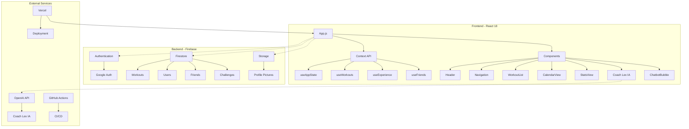

# 🏋️ Ici Ça Pousse - Application de Fitness Gamifiée avec Coach IA

[](https://reactjs.org/)
[](https://firebase.google.com/)
[](https://web.dev/progressive-web-apps/)
[](https://jestjs.io/)
[](https://jestjs.io/)
[](https://eslint.org/)
[](https://vercel.com/)
[](https://openai.com/)
[](LICENSE)

## 🌐 Application en ligne

**[ici-ca-pousse.vercel.app](https://ici-ca-pousse.vercel.app)**

Application moderne de suivi de séances de sport avec gamification avancée, fonctionnalités sociales complètes et **Coach IA intelligent** qui analyse votre historique pour proposer des recommandations personnalisées.

## ⚡ Quick Start

```bash
# Cloner le projet
git clone https://github.com/bryannakache/ici-ca-pousse.git
cd ici-ca-pousse

# Installer les dépendances
npm install

# Configurer les variables d'environnement
cp .env.example .env.local
# Éditer .env.local avec vos clés Firebase et OpenAI

# Démarrer en mode développement
npm start
```

## 🚀 Fonctionnalités

### 🧠 Coach Lex IA - Assistant Personnel Intelligent

#### 🎯 **Recommandations d'exercices intelligentes**
- **Analyse de l'historique** : Le coach analyse vos 5 dernières séances
- **Détection des groupes sous-traités** : Identifie automatiquement les muscles peu travaillés
- **Évitement des répétitions** : Évite les exercices récents (2 dernières séances)
- **Adaptation au type de séance** : Filtre selon cardio/HIIT/abdos/etc.
- **Attribution correcte des groupes musculaires** : Plus d'exercices marqués comme "custom"

#### 🏋️ **Génération automatique de séances personnalisées**
- **Bouton "Propose-moi une séance"** : Séances adaptées à votre niveau
- **Types de séances** : Full body, Haut/Bas du corps, Push/Pull, Cardio, Abdos, HIIT, Mobilité
- **Niveaux d'intensité** : Facile, Moyen, Difficile
- **Exercices en français** : Tous les exercices traduits (Mountain climbers → Grimpeur)
- **4-6 exercices** : Sélection intelligente basée sur votre historique
- **3-4 séries** : Configuration automatique selon l'intensité

#### 📊 **Analyse intelligente des séances**
- **Bouton "Récap des dernières séances"** : Analyse détaillée de vos 3 dernières séances
- **Affichage des groupes musculaires** : Chaque exercice avec son groupe associé
- **Analyse de régularité** : Détection des jours depuis la dernière séance
- **Recommandations personnalisées** : Conseils adaptés à votre progression
- **Équilibre musculaire** : Identification des groupes négligés

#### 📈 **Analyse de progression avancée**
- **Bouton "📈 Progression"** : Analyse détaillée de votre évolution
- **Progression des poids** : Suivi des charges par exercice sur 4 semaines
- **Analyse des performances** : Tendances, améliorations, points d'attention
- **Recommandations ciblées** : Conseils basés sur vos données réelles
- **Visualisation des progrès** : Graphiques et statistiques détaillées

#### 🧠 **Recommandations IA personnalisées**
- **Bouton "🧠 Conseils IA"** : Analyse complète de votre profil
- **Niveau d'activité** : Débutant, intermédiaire, avancé
- **Analyse de progression** : Évaluation de l'intensité et de la régularité
- **Conseils adaptés** : Recommandations selon votre historique
- **Objectifs personnalisés** : Suggestions d'amélioration

#### 💬 **Interface de chat unifiée**
- **Messages d'accueil automatiques** : "Bonjour [prénom], je suis Coach Lex IA"
- **Contexte enrichi** : L'IA connaît vos dernières séances, taille, poids et objectif personnel
- **Questions libres** : Sport, nutrition, motivation, bien-être
- **Messages explicatifs** : Explications des recommandations
- **Mode sombre/clair** : Interface adaptée à tous les thèmes
- **Bulle flottante** : Accès au coach depuis tous les onglets
- **Touche Entrée** : Envoi de messages avec la touche Entrée
- **Cache intelligent** : Réponses mises en cache pour optimiser les performances
- **Gestion des erreurs** : Messages d'erreur clairs en cas de problème

#### 🔄 **Fonctionnalités avancées du chatbot**
- **Analyse des ressentis** : Le coach analyse vos sensations après chaque séance
- **Conseils basés sur les ressentis** : Recommandations adaptées selon vos retours
- **Analyse de la progression des poids** : Suivi détaillé de l'évolution des charges
- **Recommandations d'intensité** : Ajustements selon vos performances récentes
- **Détection des tendances** : Identification des améliorations ou difficultés
- **Conseils de récupération** : Recommandations pour optimiser la récupération
- **Analyse de la régularité** : Évaluation de votre fréquence d'entraînement

### 🎮 Gamification Avancée
- **Système de niveaux et XP** : Progression basée sur la durée, variété d'exercices et streaks
- **Streak animé** : Compteur de jours consécutifs avec bonus XP
- **Badges et réalisations** : Débloquez des badges pour vos exploits
- **Leaderboard dynamique** : Classement entre amis selon différents critères

### 🔐 Authentification & Profil
- **Connexion Google** : Authentification rapide et sécurisée
- **Gestion du profil** : Photo, pseudo, surnom personnalisé et badge sélectionné
- **Objectifs personnalisés** : Définissez votre objectif (Perte de poids, Prise de masse, Endurance, Performance)
- **Profil intégré** : Onglet profil complet avec objectifs, taille, poids et surnom
- **Notifications en temps réel** : Suivi des invitations et rappels

### 👥 Social & Défis
- **Système d'amis** : Ajoutez, gérez vos connexions avec bouton d'invitation direct
- **Défis personnalisés** : Lancez des challenges à vos amis
- **Notifications intelligentes** : Rappels et félicitations automatiques
- **Profils enrichis** : Photos de profil, statistiques détaillées, surnoms personnalisés

### 📊 Analytics & Progression
- **Système de suivi du poids** : Enregistrez votre poids chaque semaine, visualisez votre évolution sur une courbe dédiée, recevez un rappel intelligent pour ne rien oublier.
- **Statistiques avancées** : Graphiques, comparaisons, historique
- **Courbe d'évolution du poids** : Suivi visuel de votre poids semaine par semaine, affichée en haut de la page Statistiques avec dates formatées en français
- **Notification hebdomadaire** : Rappel automatique chaque début de semaine pour mettre à jour votre poids (avec option 'C'est le même')
- **Suivi des performances** : Records personnels, tendances
- **Calendrier interactif** : Vue d'ensemble de vos séances avec bouton de suppression
- **Export de données** : Sauvegarde de vos progrès
- **Ressentis après séance** : Enregistrez vos sensations (facile, difficile, fatigué, motivé, etc.)
- **Analyse des ressentis** : Le coach IA analyse vos ressentis pour améliorer ses conseils

### 🎨 Interface Utilisateur Améliorée
- **Navigation harmonisée** : Onglets avec titres uniformes (couleur bleue, sans emojis)
- **Profil intégré** : Onglet profil complet remplaçant la modal
- **Boutons de suppression visibles** : Suppression d'exercices et de séries avec confirmation
- **Bouton "Vider la séance"** : Supprime tous les exercices d'une séance en une fois
- **Confirmations de sécurité** : Popups de confirmation avant suppression
- **Interface intuitive** : Gestion efficace des séances même quand on n'aime pas la séance proposée
- **Couleurs optimisées** : Boutons visibles en mode clair et sombre
- **Mode sombre/clair** : Bulle flottante pour changer de thème instantanément
- **Header moderne** : Design épuré avec cercle de niveau blanc et streak intégrée
- **Poids décimal** : Support des poids avec virgules (ex: 70.5 kg)
- **Modales scrollables** : Templates et création de templates avec défilement
- **Harmonisation des couleurs** : Tous les boutons en bleu (sauf suppression en rouge)
- **Mode sombre amélioré** : Bordures blanches pour meilleure visibilité

### 📊 Monitoring & Analytics
- **Vercel Analytics** : Suivi des visiteurs, pages vues, taux de rebond en temps réel
- **Vercel Speed Insights** : Métriques de performance (FCP, LCP, CLS, TTFB)
- **Monitoring automatique** : Collecte de données dès le déploiement
- **Optimisation continue** : Amélioration basée sur les métriques réelles
- **Dashboard intégré** : Visualisation des performances dans Vercel

### 🌐 Internationalisation
- **Français / Anglais** : Interface disponible dans deux langues
- **Formatage localisé** : Dates et unités adaptées automatiquement

### 📱 PWA & Mobile-First
- **Header ultra-compact** : Nouveau header moderne, mobile-first, avec titre à gauche et navigation optimisée
- **Application installable** : Fonctionne hors ligne
- **Design responsive** : Optimisé mobile et desktop
- **Performance optimisée** : Chargement rapide, animations fluides
- **Accessibilité** : Compatible avec les lecteurs d'écran
- **Mode sombre global** : Commutation instantanée clair/sombre
- **Notifications push** : Restez informé même hors de l'application

## 🏗️ Architecture



## 🛠️ Installation & Développement

### Prérequis
- Node.js 18+ 
- npm ou yarn
- Compte Firebase
- Clé API OpenAI (pour Coach Lex IA)

### Installation

```bash
# Cloner le projet
git clone https://github.com/bryannakache/ici-ca-pousse.git
cd ici-ca-pousse

# Installer les dépendances
npm install

# Démarrer en mode développement
npm start
```

### Scripts disponibles

```bash
npm start          # Démarre le serveur de développement
npm run build      # Build de production
npm test           # Lance les tests
npm run test:coverage  # Tests avec couverture
npm run lint       # Vérification du code (0 erreurs, 0 warnings)
npm run format     # Formatage automatique
```

## 🔥 Configuration Firebase

### 1. Créer un projet Firebase
1. Allez sur [Firebase Console](https://console.firebase.google.com/)
2. Créez un nouveau projet "ici-ca-pousse"
3. Activez l'authentification Google
4. Créez une base de données Firestore
5. Activez Firebase Storage

### 2. Variables d'environnement
Créez un fichier `.env.local` :

```env
REACT_APP_FIREBASE_API_KEY=your_api_key
REACT_APP_FIREBASE_AUTH_DOMAIN=your_project.firebaseapp.com
REACT_APP_FIREBASE_PROJECT_ID=your_project_id
REACT_APP_FIREBASE_STORAGE_BUCKET=your_project.appspot.com
REACT_APP_FIREBASE_MESSAGING_SENDER_ID=your_sender_id
REACT_APP_FIREBASE_APP_ID=your_app_id
REACT_APP_OPENAI_API_KEY=your_openai_api_key
```

### 3. Règles Firestore
Dans Firebase Console > Firestore Database > Rules :

```javascript
rules_version = '2';
service cloud.firestore {
  match /databases/{database}/documents {
    // Workouts - utilisateur peut lire/écrire ses propres données
    match /workouts/{workoutId} {
      allow read, write: if request.auth != null 
                         && request.auth.uid == resource.data.userId;
    }
    
    // Users - lecture publique, écriture propriétaire
    match /users/{userId} {
      allow read: if request.auth != null;
      allow write: if request.auth != null 
                   && request.auth.uid == userId;
    }
    
    // Friends - lecture/écriture pour utilisateurs connectés
    match /friends/{friendId} {
      allow read, write: if request.auth != null;
    }
    
    // Challenges - lecture/écriture pour utilisateurs connectés
    match /challenges/{challengeId} {
      allow read, write: if request.auth != null;
    }
  }
}
```

### 4. Règles Storage
Dans Firebase Console > Storage > Rules :

```javascript
rules_version = '2';
service firebase.storage {
  match /b/{bucket}/o {
    // Photos de profil
    match /profile-pictures/{userId}/{allPaths=**} {
      allow read: if request.auth != null;
      allow write: if request.auth != null 
                   && request.auth.uid == userId
                   && request.resource.size < 5 * 1024 * 1024 // 5MB max
                   && request.resource.contentType.matches('image/.*');
    }
    
    // Règles par défaut - refuser tout le reste
    match /{allPaths=**} {
      allow read, write: if false;
    }
  }
}
```

## 🧪 Tests

> **🎯 Couverture actuelle :**
> - **Statements** : 85.49%
> - **Branches** : 59.45%
> - **Functions** : 93.1%
> - **Lines** : 89.56%
> - **Tests** : 141 tests passants ✅

### Suite de Tests Complète
Le projet dispose d'une suite de tests moderne et extensible avec **141 tests passants** :

#### 🧪 **Tests de Hooks** (5 suites)
- **`useAppState`** : Gestion d'état global (100% couvert)
  - Initialisation de l'état
  - Gestion des utilisateurs
  - Synchronisation avec Firebase
  - Gestion des erreurs

- **`useExercises`** : Gestion des exercices
  - Ajout/suppression/édition d'exercices
  - Gestion des séries et répétitions
  - Validation des données
  - Intégration avec les templates

- **`useChatGPT`** : Intégration API OpenAI
  - Envoi de messages avec contexte
  - Gestion du cache intelligent
  - Gestion des erreurs API
  - Optimisation des performances

- **`useWorkouts`** : Gestion des séances
  - CRUD des séances
  - Calcul des statistiques
  - Intégration avec le calendrier
  - Gestion des ressentis

- **`useUserProfile`** : Gestion des profils
  - Mise à jour des informations utilisateur
  - Gestion des photos de profil
  - Synchronisation des préférences

#### 🧪 **Tests de Composants** (1 suite)
- **`Chatbot`** : Interface de chat intelligente
  - ✅ Envoi de messages avec contexte personnalisé
  - ✅ Gestion de la touche Entrée
  - ✅ Messages d'accueil automatiques
  - ✅ Gestion des workouts avec exercices vides
  - ✅ Gestion des workouts avec propriétés manquantes
  - ✅ Utilisation de la clé API OpenAI
  - ✅ Interface unifiée et responsive
  - ✅ Gestion des erreurs et validation

#### 🧪 **Tests Utilitaires** (2 suites)
- **`workoutUtils`** : Utilitaires pour les séances
  - Calculs de statistiques
  - Analyse des performances
  - Formatage des données
  - Gestion des badges

- **`leaderboardUtils`** : Utilitaires pour les classements
  - Calcul des classements
  - Statistiques des utilisateurs
  - Gestion des labels et catégories

### 🚀 Lancement des tests

```bash
# Tests unitaires et d'intégration
npm test

# Tests avec couverture détaillée
npm run test:coverage

# Tests en mode watch (développement)
npm test -- --watch

# Tests d'un fichier spécifique
npm test -- --testPathPattern=Chatbot.test.js

# Tests avec rapport de couverture
npm test -- --coverage --watchAll=false
```

### 📊 Métriques de Qualité

| Métrique | Valeur | Statut |
|----------|--------|--------|
| **Tests passants** | 141/141 | ✅ 100% |
| **Couverture statements** | 85.49% | ✅ Excellent |
| **Couverture functions** | 93.1% | ✅ Excellent |
| **Couverture lines** | 89.56% | ✅ Excellent |
| **ESLint** | 0 erreurs, 0 warnings | ✅ Parfait |
| **Build** | Succès | ✅ Stable |

### 🔧 Tests du Coach IA

Les tests du chatbot couvrent spécifiquement :

- **Interface utilisateur** : Rendu correct, gestion des événements
- **Logique métier** : Génération de contexte, validation des données
- **Intégration API** : Communication avec OpenAI, gestion des erreurs
- **Performance** : Cache intelligent, optimisation des requêtes
- **Accessibilité** : Support clavier, messages d'erreur clairs

### 🎯 Exemples de Tests

```javascript
// Test d'envoi de message avec contexte
it('sends message with workout summary and context', async () => {
  // Arrange
  const workouts = [{ date: '2024-01-01', exercises: [...] }];
  
  // Act
  fireEvent.change(input, { target: { value: 'Hello' } });
  fireEvent.click(sendButton);
  
  // Assert
  await waitFor(() => {
    expect(mockChatGPT.sendMessage).toHaveBeenCalledWith(
      'Hello', 
      expect.stringContaining('Répartition')
    );
  });
});

// Test de la touche Entrée
it('handles Enter key press', async () => {
  // Arrange & Act
  fireEvent.keyDown(input, { key: 'Enter' });
  
  // Assert
  await waitFor(() => {
    expect(mockChatGPT.sendMessage).toHaveBeenCalled();
  });
});
```

## 📈 Roadmap 2025

### ✅ Complété
- [x] Système de niveaux, XP et progression
- [x] Streak animé avec bonus
- [x] Leaderboard dynamique entre amis
- [x] Badges, réalisations et photos de profil
- [x] Défis entre amis et notifications intelligentes
- [x] PWA installable et design mobile-first
- [x] Header ultra-compact et moderne
- [x] Suite de tests complète (141 tests passants)
- [x] Coach Lex IA (fonctionnel en développement, accès aux données utilisateur, interface unifiée, conseils personnalisés)
- [x] Système de suivi du poids (courbe d'évolution, notification hebdomadaire intelligente)
- [x] Génération automatique de séances personnalisées par le coach (type, intensité, exercices/séries aléatoires)
- [x] Messages de félicitations automatiques après chaque séance
- [x] Bulle de chat flottante avec synchronisation des messages
- [x] Récapitulatif intelligent des dernières séances avec recommandations
- [x] Surnoms personnalisés dans le profil et leaderboard
- [x] Boutons d'invitation d'amis dans le leaderboard
- [x] Bouton de suppression des séances dans le calendrier
- [x] Code propre avec 0 erreurs ESLint
- [x] **Recommandations d'exercices intelligentes** (analyse historique, groupes sous-traités)
- [x] **Traduction complète des exercices en français** (Mountain climbers → Grimpeur)
- [x] **Attribution correcte des groupes musculaires** (plus d'exercices "custom")
- [x] **Interface de suppression améliorée** (boutons visibles, confirmations, "Vider la séance")
- [x] **Analyse intelligente des séances** (régularité, progression, équilibre musculaire)
- [x] **Analyse de progression avancée** (bouton "📈 Progression" avec analyse détaillée des poids)
- [x] **Système de ressentis** (enregistrement des sensations après chaque séance)
- [x] **Mode sombre/clair** (bulle flottante pour changer de thème)
- [x] **Poids décimal** (support des poids avec virgules)
- [x] **Header optimisé** (cercle de niveau blanc, streak intégrée)
- [x] **Dates corrigées** (calcul correct des semaines pour l'évolution du poids)
- [x] **Vercel Analytics & Speed Insights** (monitoring des performances et analytics)
- [x] **Objectifs personnalisés** (Perte de poids, Prise de masse, Endurance, Performance)
- [x] **Profil intégré** (onglet profil complet avec objectifs, taille, poids)
- [x] **Harmonisation des couleurs** (tous les boutons en bleu, suppression en rouge)
- [x] **Mode sombre amélioré** (bordures blanches pour meilleure visibilité)
- [x] **Modales scrollables** (templates et création de templates)
- [x] **Navigation harmonisée** (titres uniformes en bleu)
- [x] **Tests du chatbot** (141 tests passants, couverture complète)
- [x] **Touche Entrée** (envoi de messages avec la touche Entrée)
- [x] **Cache intelligent** (optimisation des performances du chatbot)
- [x] **Gestion des erreurs** (messages d'erreur clairs et robustesse)

### 🚧 En développement
- [ ] Analyse de performance avancée
- [ ] Intégration wearables (Apple Watch, Fitbit)

### 📋 Planifié
- [ ] Thèmes personnalisables
- [ ] Export/import de données (poids, séances, etc.)
- [ ] Analyse avancée du poids (tendances, alertes, objectifs)
- [ ] Suggestions IA ultra-personnalisées (nutrition, récupération, etc.)
- [ ] Mode compétition avancé
- [ ] Réseau social enrichi

## 🔧 Dépannage

### Erreurs Firebase
- **Erreur 404 Storage** : Firebase Storage non activé
- **Erreur CORS** : Règles de sécurité incorrectes
- **Erreur d'autorisation** : Utilisateur non connecté
- **Erreur de quota** : Limite de stockage atteinte

### Erreurs courantes
- **Photos de profil** : Vérifiez la configuration Storage
- **Authentification** : Vérifiez les variables d'environnement
- **Synchronisation** : Vérifiez les règles Firestore
- **Performance** : Vérifiez la taille des images uploadées
- **Coach Lex IA** : Vérifiez la clé API OpenAI

### Support
- **Issues** : [GitHub Issues](https://github.com/bryannakache/ici-ca-pousse/issues)
- **Documentation** : [Wiki du projet](https://github.com/bryannakache/ici-ca-pousse/wiki)

## 🤝 Contribution

### Comment contribuer
1. Fork le projet
2. Créez une branche feature (`git checkout -b feature/AmazingFeature`)
3. Committez vos changements (`git commit -m 'Add AmazingFeature'`)
4. Push vers la branche (`git push origin feature/AmazingFeature`)
5. Ouvrez une Pull Request

### Standards de code
- **ESLint** : Configuration standard React (0 erreurs, 0 warnings)
- **Prettier** : Formatage automatique
- **Tests** : Minimum 80% de couverture
- **Commits** : Convention Conventional Commits

## 📄 Licence

Ce projet est sous licence MIT. Voir le fichier [LICENSE](LICENSE) pour plus de détails.

## 👨‍💻 Développeur

- **Développeur Full-Stack** : [Bryan Nakache](https://github.com/bryannakache)
- **Technologies** : React, Firebase, PWA, Gamification, IA, Vercel Analytics, Speed Insights
- **Focus** : UX/UI, Performance, Tests, Code Quality

---

## 🎯 Exemples d'utilisation du Coach IA

#### 💬 Questions générales
- "Comment améliorer ma récupération après l'entraînement ?"
- "Peux-tu me donner une recette saine ?"
- "J'ai du mal à rester motivé, des conseils ?"
- "Explique-moi la différence entre cardio et musculation."
- "Quels sont les bienfaits de la méditation ?"

#### 🏋️ Génération de séances
- "Propose-moi une séance full body difficile"
- "Je veux une séance abdos facile"
- "Donne-moi une séance cardio pour perdre du poids"

#### 📊 Analyse et conseils
- "Comment analyser mes progrès ?"
- "Quels exercices pour renforcer mes épaules ?"
- "Je me sens fatigué, que faire ?"

#### 📈 Progression et performance
- "Analyse ma progression sur les derniers mois"
- "Quels sont mes points forts et mes axes d'amélioration ?"
- "Comment optimiser mes séances pour progresser plus vite ?"

#### 🔄 Nouvelles fonctionnalités
- **Touche Entrée** : Appuyez sur Entrée pour envoyer un message
- **Cache intelligent** : Les réponses sont mises en cache pour plus de rapidité
- **Analyse des ressentis** : Le coach analyse vos sensations après chaque séance
- **Recommandations personnalisées** : Conseils adaptés selon votre historique et objectifs

---

<div align="center">

**⭐ Si ce projet vous plaît, n'oubliez pas de le star sur GitHub ! ⭐**

[](https://github.com/bryannakache/ici-ca-pousse/stargazers)
[](https://github.com/bryannakache/ici-ca-pousse/network/members)

</div>

