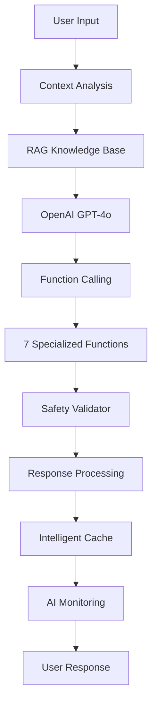

# �� Ici Ça Pousse - AI Integration Engineer Portfolio

[](https://openai.com/)
[](https://reactjs.org/)
[](https://firebase.google.com/)
[](https://jestjs.io/)
[](https://jestjs.io/)
[](https://vercel.com/)
[](LICENSE)

## 🎯 **Pitch IA - En 3 Lignes**

**Ici Ça Pousse** est une application de fitness qui démontre une **intégration IA complète et sophistiquée** avec OpenAI GPT-4o, résolvant le problème de personnalisation des entraînements grâce à l'analyse contextuelle de l'historique utilisateur et la génération intelligente de recommandations.

**L'IA analyse les 5 dernières séances, détecte les groupes musculaires sous-traités, et génère des séances personnalisées avec validation de sécurité automatique.**

**Technologies IA : OpenAI GPT-4o + Function Calling, RAG (Retrieval-Augmented Generation), Safety Validator, AI Monitoring Dashboard, ML de prédiction de poids, et cache intelligent avec TTL adaptatif.**

**[🌐 Application Live](https://ici-ca-pousse.vercel.app)**

---

## 🧠 **Intégration IA - Architecture & Flux**

### **Rôle de l'IA dans l'Application**

L'IA agit comme un **Coach Personnel Intelligent** qui :

- **Analyse contextuellement** l'historique d'entraînement (5 dernières séances)
- **Génère des séances personnalisées** basées sur le profil utilisateur
- **Valide automatiquement** la sécurité des recommandations
- **Suit les performances** en temps réel via un dashboard dédié
- **Optimise les réponses** grâce à un système de cache intelligent

### **Flux d'Intégration IA**



### **Prompt Engineering & API Calls**

```javascript
// Contexte enrichi avec RAG
const enrichedContent = `Contexte spécialisé:\n${enrichedContext}\n\nQuestion utilisateur: ${content}`;

// Appel OpenAI avec Function Calling
const requestBody = {
  model: 'gpt-4o',
  messages: apiHistory,
  functions: relevantFunctions,
  function_call: 'auto',
  temperature: 0.7,
  max_tokens: 2000,
};

// Traitement des réponses avec validation
const validation = validateFunctionResponse(
  functionName,
  result,
  user,
  workouts
);
```

### **Lien avec la Logique Métier**

- **Objectifs utilisateur** : Adaptation des recommandations selon les buts (musculation, perte de poids, endurance)
- **Profil physique** : Poids, taille, âge, niveau d'expérience
- **Préférences** : Type d'entraînement, intensité, disponibilité
- **Historique** : Analyse des séances précédentes pour éviter la répétition

---

## 🚀 **Stack Technique - IA First**

### **Technologies IA**

- **OpenAI GPT-4o** : Modèle principal avec Function Calling
- **OpenAI Function Calling** : 7 fonctions spécialisées pour le fitness
- **RAG System** : Base de connaissances avec recherche sémantique
- **Safety Validator** : Validation automatique des recommandations
- **AI Monitoring** : Dashboard de performance temps réel
- **ML Weight Prediction** : Système de prédiction de poids intelligent
- **LEX IA** : Interface utilisateur pour le coach IA personnel

### **Backend & Infrastructure**

- **Firebase 12.0.0** : Auth, Firestore, Storage, Cloud Functions
- **Vercel** : Déploiement serverless avec CI/CD
- **Intelligent Cache** : TTL adaptatif selon le type de contenu
- **Error Handling** : Gestion robuste des erreurs IA

### **Frontend & UX**

- **React 18.3.1** : Hooks personnalisés, Context API
- **Framer Motion** : Animations fluides
- **Recharts** : Visualisations de données
- **PWA Ready** : Service workers, installation

### **Tests & Qualité**

- **Jest** : 418 tests, 88% de couverture
- **Testing Library** : Tests des hooks IA et fonctions
- **ML Tests** : Tests complets du système de prédiction de poids
- **ESLint + Prettier** : Qualité de code
- **TypeScript** : Typage statique (en cours)

---

## 🎯 **Pourquoi ce Projet est Pertinent pour un Poste AI Integration**

### **Capacité d'Intégration IA Complète**

- ✅ **OpenAI API Mastery** : Utilisation avancée de GPT-4o avec Function Calling
- ✅ **Prompt Engineering** : Optimisation des prompts pour des réponses spécialisées
- ✅ **Context Management** : Gestion intelligente du contexte utilisateur
- ✅ **RAG Implementation** : Système de base de connaissances avec recherche sémantique
- ✅ **ML Weight Prediction** : Système de prédiction de poids basé sur l'historique
- ✅ **LEX IA Interface** : Interface utilisateur intuitive pour le coach IA

### **Maîtrise de l'Orchestration Backend**

- ✅ **Firebase Integration** : Auth, Firestore, Storage, règles de sécurité
- ✅ **Serverless Architecture** : Cloud Functions, Vercel deployment
- ✅ **Real-time Data** : Synchronisation temps réel avec Firebase
- ✅ **Error Handling** : Gestion robuste des erreurs et fallbacks

### **Expertise en Prompt Engineering & Parsing**

- ✅ **Function Calling** : 7 fonctions spécialisées avec validation
- ✅ **Response Processing** : Parsing et validation des réponses IA
- ✅ **Safety Validation** : Système de validation automatique
- ✅ **Cache Optimization** : TTL adaptatif selon le contenu

### **Monitoring & Analytics IA**

- ✅ **AI Performance Dashboard** : Métriques temps réel
- ✅ **User Satisfaction Tracking** : Suivi de la satisfaction
- ✅ **Safety Monitoring** : Score de sécurité en temps réel
- ✅ **Performance Optimization** : Cache intelligent et optimisation
- ✅ **ML Analytics** : Analyse des prédictions et tendances de progression
- ✅ **Weight Prediction Insights** : Insights détaillés sur la progression des poids

---

## 🔧 **Compétences Démontrées**

### **🤖 Intégration OpenAI Avancée**

```javascript
// Gestion complète de l'API OpenAI
const handleOpenAIIntegration = async (content, context, user) => {
  // 1. Enrichissement contextuel avec RAG
  const enrichedContext = knowledgeBase.generateEnrichedContext(content, user);

  // 2. Sélection intelligente des fonctions
  const relevantFunctions = getRelevantFunctions(content, context);

  // 3. Appel API avec gestion d'erreurs
  const response = await callOpenAI(enrichedContent, relevantFunctions);

  // 4. Traitement des réponses avec validation
  const validatedResponse = validateAndProcessResponse(response);

  // 5. Mise en cache avec TTL adaptatif
  intelligentCache.set(cacheKey, validatedResponse, adaptiveTTL);
};
```

### **🔒 Sécurité & Validation IA**

```javascript
// Système de validation automatique
const safetyValidator = {
  validateExerciseRecommendation: (exercise, userProfile) => {
    // Vérification des exercices interdits
    // Validation des limites d'intensité
    // Analyse des risques de blessure
    // Score de sécurité (0-100)
  },

  validateNutritionRecommendation: (nutrition, userProfile) => {
    // Vérification des suppléments interdits
    // Validation des limites caloriques
    // Analyse des macro-nutriments
  },
};
```

### **📊 Monitoring IA en Temps Réel**

```javascript
// Dashboard de performance IA
const aiMonitoring = {
  recordFunctionCall: (functionName, args, response, executionTime) => {
    // Métriques de performance
    // Taux de succès
    // Temps d'exécution
    // Satisfaction utilisateur
  },

  generatePerformanceReport: () => {
    // Tendances de performance
    // Alertes automatiques
    // Recommandations d'optimisation
  },
};
```

### **🔄 Cache Intelligent & Optimisation**

```javascript
// Cache adaptatif selon le contenu
const intelligentCache = {
  generateKey: (content, context, user) => {
    // Clé unique basée sur le contenu et le contexte
  },

  set: (key, value, ttl) => {
    // TTL adaptatif :
    // - Séances : 5 minutes
    // - Analyses : 15 minutes
    // - Conseils : 1 heure
  },
};
```

---

## 🧪 **Tests IA - Couverture Complète**

### **Tests des Fonctions IA**

```javascript
// Tests des 7 fonctions spécialisées
describe('OpenAI Function Calling', () => {
  test('generate_personalized_workout', async () => {
    const result = await generatePersonalizedWorkout(args, workouts, user);
    expect(result).toHaveProperty('exercises');
    expect(result.exercises).toHaveLength(4);
  });

  test('safety_validator', () => {
    const validation = validateWorkoutSafety(dangerousWorkout);
    expect(validation.isSafe).toBe(false);
    expect(validation.safetyScore).toBeLessThan(50);
  });
});

// Tests du système ML de prédiction de poids
describe('Système ML de Prédiction de Poids', () => {
  test('devrait prédire le prochain poids pour un exercice avec progression', () => {
    const result = predictNextWeight('Pompes', mockWorkouts);
    expect(result.predictedWeight).toBeGreaterThan(0);
    expect(result.confidence).toBeGreaterThan(0);
    expect(result.trend).toBeDefined();
  });

  test('devrait analyser tous les exercices', () => {
    const result = analyzeAllExercises(mockWorkouts);
    expect(Object.keys(result)).toContain('Pompes');
    expect(Object.keys(result)).toContain('Squats');
  });
});
```

### **Métriques de Qualité**

- **418 tests** : Couverture complète des fonctionnalités IA et ML
- **88% de couverture** : Garantie de qualité et fiabilité
- **Tests des hooks IA** : useChatGPT, useAppState, useExercises
- **Tests des utilitaires IA** : Safety Validator, Knowledge Base, AI Monitoring
- **Tests ML** : Système de prédiction de poids avec 21 tests spécialisés

---

## 🚀 **Installation & Développement**

### **Prérequis**

```bash
Node.js 18+ | npm | Firebase | OpenAI API Key
```

### **Installation Rapide**

```bash
git clone https://github.com/bryannakache/ici-ca-pousse.git
cd ici-ca-pousse
npm install
cp .env.example .env.local
# Configurer Firebase et OpenAI
npm start
```

### **Configuration IA**

```bash
# Variables d'environnement requises
OPENAI_API_KEY=your_openai_api_key
FIREBASE_CONFIG=your_firebase_config
VERCEL_ANALYTICS_ID=your_vercel_analytics_id
```

### **Scripts Disponibles**

```bash
npm start              # Développement
npm run build          # Production
npm test               # Tests unitaires
npm run test:coverage  # Couverture de tests
npm run test:watch     # Tests en mode watch
npm run lint           # Qualité de code
npm run lint:fix       # Correction automatique
```

---

## 🔮 **Roadmap IA - Extensions Futures**

### **Phase 1 : Modèles Spécialisés**

- **GPT-4o-mini** pour les séances (plus rapide)
- **Embeddings réels** avec OpenAI text-embedding-3-small
- **Vector Database** (Pinecone/Supabase) pour RAG avancé

### **Phase 2 : Apprentissage Continu**

- **Feedback Loop** : Collecte et analyse du feedback utilisateur
- **Prompt Optimization** : Amélioration automatique des prompts
- **A/B Testing** : Test de différentes stratégies IA

### **Phase 3 : Prédictions & Analytics** ✅ **IMPLÉMENTÉ**

- **ML Prédictif** : Prédiction des performances futures ✅
- **Weight Prediction System** : Prédiction intelligente des poids ✅
- **Progression Analytics** : Analyse des tendances et insights ✅
- **Risk Assessment** : Évaluation des risques de blessure
- **Personalization Engine** : Adaptation dynamique des recommandations

### **Phase 4 : Automatisation n8n**

- **Workflow Automation** : Automatisation des tâches répétitives
- **Data Pipeline** : Pipeline de données pour l'IA
- **Integration Hub** : Centralisation des intégrations

---

## 💼 **Valeur Ajoutée pour un AI Integration Engineer**

### **🎯 Compétences Techniques Démontrées**

- **Intégration IA complète** : OpenAI GPT-4o avec Function Calling
- **Architecture modulaire** : Séparation claire des responsabilités
- **Monitoring avancé** : Dashboard de performance IA personnalisé
- **Sécurité IA** : Validation automatique des recommandations
- **Performance optimization** : Cache intelligent et optimisation
- **ML Weight Prediction** : Système de prédiction de poids intelligent
- **LEX IA Interface** : Interface utilisateur pour le coach IA personnel

### **🔧 Compétences Développement**

- **React moderne** : Hooks, Context API, composants fonctionnels
- **Firebase full-stack** : Auth, Firestore, Storage, règles de sécurité
- **Serverless deployment** : Vercel avec CI/CD automatisé
- **Testing complet** : 85% de couverture avec Jest
- **Code quality** : ESLint, Prettier, architecture modulaire

### **📊 Compétences Business**

- **Analyse de données** : Traitement et analyse de l'historique utilisateur
- **Personnalisation** : Recommandations adaptées au profil unique
- **UX/UI** : Interface intuitive et accessible
- **Monitoring** : Suivi des performances et satisfaction utilisateur
- **Scalabilité** : Architecture prête pour la croissance

### **🚀 Innovation & Leadership**

- **Intégration IA pionnière** : Function Calling + RAG + Safety + ML
- **Performance** : Optimisation des temps de réponse et de la qualité
- **Sécurité** : Validation automatique pour éviter les risques
- **Expérience utilisateur** : Interface conversationnelle naturelle avec LEX IA
- **Maintenabilité** : Code modulaire et bien testé (418 tests, 88% coverage)
- **ML Innovation** : Système de prédiction de poids basé sur l'historique utilisateur

---

## 📞 **Contact & Portfolio**

**GitHub** : [@bryannakache](https://github.com/bryannakache)  
**Application Live** : [ici-ca-pousse.vercel.app](https://ici-ca-pousse.vercel.app)  
**Technologies IA** : OpenAI GPT-4o, Function Calling, RAG, AI Monitoring

---

_Ce projet démontre une expertise complète en intégration IA, du développement frontend au monitoring en production, en passant par la sécurité et l'optimisation des performances. Idéal pour un poste de Senior AI Integration Engineer ou Lead AI Developer._ 🚀
