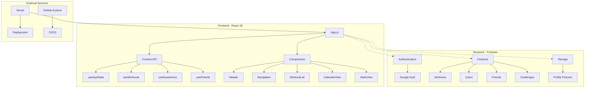

# 🏋️ Ici Ça Pousse - Application de Fitness Gamifiée

[](https://reactjs.org/)
[](https://firebase.google.com/)
[](https://web.dev/progressive-web-apps/)
[](https://jestjs.io/)
[](https://vercel.com/)

## 🌐 Application en ligne

**[ici-ca-pousse.vercel.app](https://ici-ca-pousse.vercel.app)**

Application moderne de suivi de séances de sport avec gamification avancée et fonctionnalités sociales complètes.

## 🚀 Fonctionnalités

### 🎮 Gamification Avancée
- **Système de niveaux et XP** : Progression basée sur la durée, variété d'exercices et streaks
- **Streak animé** : Compteur de jours consécutifs avec bonus XP
- **Badges et réalisations** : Débloquez des badges pour vos exploits
- **Leaderboard dynamique** : Classement entre amis selon différents critères

### 👥 Social & Défis
- **Système d'amis** : Ajoutez, gérez vos connexions
- **Défis personnalisés** : Lancez des challenges à vos amis
- **Notifications intelligentes** : Rappels et félicitations automatiques
- **Profils enrichis** : Photos de profil, statistiques détaillées

### 📊 Analytics & Progression
- **Statistiques avancées** : Graphiques, comparaisons, historique
- **Suivi des performances** : Records personnels, tendances
- **Calendrier interactif** : Vue d'ensemble de vos séances
- **Export de données** : Sauvegarde de vos progrès

### 📱 PWA & Mobile-First
- **Application installable** : Fonctionne hors ligne
- **Design responsive** : Optimisé mobile et desktop
- **Performance optimisée** : Chargement rapide, animations fluides
- **Accessibilité** : Compatible avec les lecteurs d'écran

## 🏗️ Architecture



### 📁 Structure du Projet

```
src/
├── components/
│   ├── common/           # Composants réutilisables
│   ├── features/         # Fonctionnalités métier
│   │   ├── auth/
│   │   ├── workout/
│   │   ├── badges/
│   │   ├── challenges/
│   │   ├── leaderboard/
│   │   ├── profile/
│   │   └── stats/
│   └── layout/           # Composants de mise en page
├── hooks/                # Hooks personnalisés
├── utils/                # Utilitaires
├── constants/            # Constantes
└── App.js               # Point d'entrée
```

## 🛠️ Installation & Développement

### Prérequis
- Node.js 18+ 
- npm ou yarn
- Compte Firebase

### Installation

```bash
# Cloner le projet
git clone https://github.com/bryannakache/ici-ca-pousse.git
cd ici-ca-pousse

# Installer les dépendances
npm install

# Démarrer en mode développement
npm start
```

### Scripts disponibles

```bash
npm start          # Démarre le serveur de développement
npm run build      # Build de production
npm test           # Lance les tests
npm run test:coverage  # Tests avec couverture
npm run lint       # Vérification du code
npm run format     # Formatage automatique
```

## 🔥 Configuration Firebase

### 1. Créer un projet Firebase
1. Allez sur [Firebase Console](https://console.firebase.google.com/)
2. Créez un nouveau projet "ici-ca-pousse"
3. Activez l'authentification Google
4. Créez une base de données Firestore
5. Activez Firebase Storage

### 2. Variables d'environnement
Créez un fichier `.env.local` :

```env
REACT_APP_FIREBASE_API_KEY=your_api_key
REACT_APP_FIREBASE_AUTH_DOMAIN=your_project.firebaseapp.com
REACT_APP_FIREBASE_PROJECT_ID=your_project_id
REACT_APP_FIREBASE_STORAGE_BUCKET=your_project.appspot.com
REACT_APP_FIREBASE_MESSAGING_SENDER_ID=your_sender_id
REACT_APP_FIREBASE_APP_ID=your_app_id
```

### 3. Règles Firestore
Dans Firebase Console > Firestore Database > Rules :

```javascript
rules_version = '2';
service cloud.firestore {
  match /databases/{database}/documents {
    // Workouts - utilisateur peut lire/écrire ses propres données
    match /workouts/{workoutId} {
      allow read, write: if request.auth != null 
                         && request.auth.uid == resource.data.userId;
    }
    
    // Users - lecture publique, écriture propriétaire
    match /users/{userId} {
      allow read: if request.auth != null;
      allow write: if request.auth != null 
                   && request.auth.uid == userId;
    }
    
    // Friends - lecture/écriture pour utilisateurs connectés
    match /friends/{friendId} {
      allow read, write: if request.auth != null;
    }
    
    // Challenges - lecture/écriture pour utilisateurs connectés
    match /challenges/{challengeId} {
      allow read, write: if request.auth != null;
    }
  }
}
```

### 4. Règles Storage
Dans Firebase Console > Storage > Rules :

```javascript
rules_version = '2';
service firebase.storage {
  match /b/{bucket}/o {
    // Photos de profil
    match /profile-pictures/{userId}/{allPaths=**} {
      allow read: if request.auth != null;
      allow write: if request.auth != null 
                   && request.auth.uid == userId
                   && request.resource.size < 5 * 1024 * 1024 // 5MB max
                   && request.resource.contentType.matches('image/.*');
    }
    
    // Règles par défaut - refuser tout le reste
    match /{allPaths=**} {
      allow read, write: if false;
    }
  }
}
```

### 5. Fichiers de configuration Firebase
Le projet contient plusieurs fichiers de configuration Firebase utiles :

- **`firebase-storage-rules.txt`** : Règles Storage complètes pour les photos de profil
- **`firebase-firestore-rules-default.txt`** : Règles Firestore par défaut (accès complet)
- **`firebase-storage-rules-default.txt`** : Règles Storage par défaut (accès complet)
- **`FIREBASE_SETUP.md`** : Guide détaillé de configuration Firebase
- **`REFACTORING_NOTES.md`** : Notes sur l'architecture et les refactorings
- **`ARCHITECTURE.md`** : Documentation de l'architecture du projet

**⚠️ Note** : Les fichiers `*-default.txt` contiennent des règles moins sécurisées pour le développement. Utilisez les règles sécurisées en production.

## 🚀 Déploiement

### Déploiement automatique (recommandé)
1. Connectez votre repo GitHub à Vercel
2. Configurez les variables d'environnement dans Vercel
3. Déploiement automatique à chaque push

### Déploiement manuel
```bash
npm run build
# Uploadez le dossier build/ sur votre hébergeur
```

## 🧪 Tests

### Lancement des tests
```bash
# Tests unitaires
npm test

# Tests avec couverture
npm run test:coverage

# Tests en mode watch
npm test -- --watch
```

### Couverture actuelle
- **Statements** : 4.06%
- **Branches** : 1.81%
- **Functions** : 4.12%
- **Lines** : 4.28%

## 📈 Roadmap 2025

### ✅ Complété
- [x] Système de niveaux et XP
- [x] Streak animé avec bonus
- [x] Leaderboard dynamique
- [x] Badges et réalisations
- [x] Défis entre amis
- [x] Notifications intelligentes
- [x] PWA installable
- [x] Photos de profil

### 🚧 En développement
- [ ] Chatbot IA pour recommandations d'entraînement
- [ ] Recommandations d'exercices intelligentes
- [ ] Analyse de performance avancée
- [ ] Intégration wearables (Apple Watch, Fitbit)

### 📋 Planifié
- [ ] Thèmes personnalisables
- [ ] Export/import de données
- [ ] Mode compétition avancé
- [ ] Réseau social enrichi

## 🔧 Dépannage

### Erreurs Firebase
- **Erreur 404 Storage** : Firebase Storage non activé
- **Erreur CORS** : Règles de sécurité incorrectes
- **Erreur d'autorisation** : Utilisateur non connecté
- **Erreur de quota** : Limite de stockage atteinte

### Erreurs courantes
- **Photos de profil** : Vérifiez la configuration Storage
- **Authentification** : Vérifiez les variables d'environnement
- **Synchronisation** : Vérifiez les règles Firestore
- **Performance** : Vérifiez la taille des images uploadées

### Support
- **Issues** : [GitHub Issues](https://github.com/bryannakache/ici-ca-pousse/issues)
- **Documentation** : [Wiki du projet](https://github.com/bryannakache/ici-ca-pousse/wiki)

## 🤝 Contribution

### Comment contribuer
1. Fork le projet
2. Créez une branche feature (`git checkout -b feature/AmazingFeature`)
3. Committez vos changements (`git commit -m 'Add AmazingFeature'`)
4. Push vers la branche (`git push origin feature/AmazingFeature`)
5. Ouvrez une Pull Request

### Standards de code
- **ESLint** : Configuration standard React
- **Prettier** : Formatage automatique
- **Tests** : Minimum 80% de couverture
- **Commits** : Convention Conventional Commits

## 📄 Licence

Ce projet est sous licence MIT. Voir le fichier [LICENSE](LICENSE) pour plus de détails.

## 👨‍💻 Développeur

- **Développeur Full-Stack** : [Bryan Nakache](https://github.com/bryannakache)
- **Technologies** : React, Firebase, PWA, Gamification
- **Focus** : UX/UI, Performance, Tests

---

**Développé avec ❤️ par Bryan Nakache**

*Transformez vos séances en aventure gamifiée !*
